<div id="top"></div>


[](../LICENSE)
[](https://www.python.org/)

<h4 align="center">中文 | <a href="../_en/README.md">English</a></h4>

## 目录
* [这是什么？](#这是什么)
* [谁来使用？](#谁来使用)
* [项目由来](#项目由来)
* [项目愿景](#项目愿景)
* [项目使用说明](#项目使用说明)
* [数学单元程序列表](#数学单元程序列表)
* [编程问题设计原则](#编程问题设计原则)
* [程序设计理念](#程序设计理念)
* [运行环境搭建](#运行环境搭建)
    * [安装 Python](#安装-python以下三种方式任选一种即可)
    * [代码编辑器](#代码编辑器-code-editor)
    * [交互式解释器](#交互式解释器-interactive-interpreter)
    * [安装外部库](#安装外部库-library)
* [常用参考资料](#常用参考资料)

## 这是什么？

2022 年开始，我受父母之托带弟弟学习小学数学，当时他 6 岁，我高一。每学完一个单元，我都会给他布置 1-2 个与本单元数学内容紧密联系的编程问题，程序采用 Python 语言编写。采用这种 “数学+编程” 的方式，我们平均每两个月完成一个学期的课程，一年左右完成了小学三至五年级的数学学习。

项目库中的文件是我们在这一年中编写的 60 个 Python 程序（22 个图形界面，38 个字符界面），涵盖了人教版小学数学教材三至五年级的 49 个单元。`小学数学编程手册.pdf` 文件中包含每个单元的主要数学内容和程序介绍。我们还为所有程序添加了详细的文档说明 (Docstring) 和程序注释 (Comment)。

| `图形界面` | `字符界面` |
| --- | --- |
| 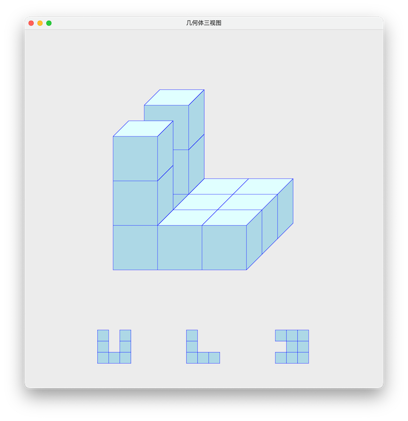 | 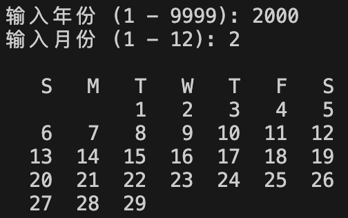 |

学习手册和所有程序都有英文和中文两个独立版本。`_en` 目录是英文版，英文版程序的屏幕显示内容和程序注释是英文；`_cn` 目录是与 `_en` 目录结构完全一样的中文版，中文版程序的屏幕显示内容和程序注释是中文。

<p align="center">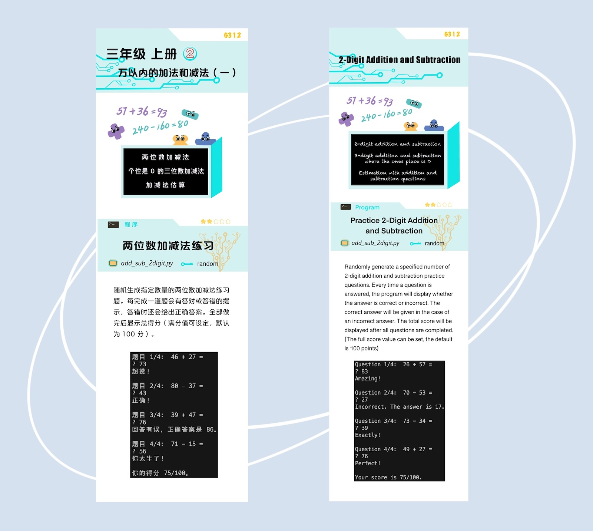</p>

[中文版小学数学编程手册.pdf 下载](https://feli10.github.io/math-coding/docs/小学数学编程手册.pdf)

[英文版小学数学编程手册.pdf 下载](https://feli10.github.io/math-coding/docs/math_coding_handbook.pdf)

实践证明，“数学+编程” 让学习者在高效学习数学的同时，还能熟练掌握一门编程语言。

## 谁来使用？

使用本项目高效学习小学数学编程需要满足以下两个条件：

1. 对数学和编程感兴趣的小学数学学习者；
2. 愿意投入时间精力与孩子共同成长的人，包括但不限于：爸爸妈妈、哥哥姐姐、教师或社区志愿者。

具体使用时分为两种情况：

1. 跟随学校进度：本项目可以作为学校数学学习的辅助学习工具，适合想同时学好数学和编程的学习者；
2. 按照个人进度：可以按照项目中介绍的[学习方法](https://feli10.github.io/math-coding/cn/project.html)，加速完成小学数学的学习。

## 项目由来

2022 年，我弟弟小续 6 岁，爸之前已经带他学完了小学二年级数学。为了让我承担起做哥哥的责任，可能也为了锻炼我吧，爸妈让我负责小续后续的数学和英文学习。我比小续大 10 岁，当时高一，最初约定的目标是在我上大学前，带小续完成小学数学的学习，英文听说读写达到他后续可以自学的水平。我是家里英文最好的，所以带他学英文责无旁贷，可数学怎么学呢？

我是 9 岁时完成的小学数学，回想起来印象已经不深了，只记得当时有段时间经常翻看数学书、做练习题，最后还做了不少小升初的数学卷子。可小续才 6 岁，单纯做题的方式适合他吗？根据我的学习经验，如果一类题总是不会做或做错，通常是对背后的知识点理解有误或理解不深刻。做题的目的应该是找出这些薄弱点加以解决，如果只是一味做题，治标不治本，相同的错误还会一再出现，这也是题海战术效率较低的原因。

为了提高我们的教学效率，最好能找到一种方法，在他大量做题前（例如做卷子），就已经对所学知识和技能有较好的理解和掌握。我作为导师的主要职责是引领、点拨和答疑，还是要靠他自己在解决问题过程中的思考和实践，才能在他的头脑中对知识建立起正确的模型和联系。所以理想的学习环境应该是这样的：小续努力去思考和尝试解决一个问题，而且有人能为他的每次尝试提供快速反馈，让他可以不断修正自己的解题思路和方法。如果那个人不是我，那就只能是电脑。我思来想去最符合这个环境的除了游戏，就是编程了。

确定 “数学+编程” 的另一个原因与我当时做的一个机器学习项目有关。这个项目需要我先学习一些大学数学的课程，我才发现在大学阶段使用编程工具辅助数学学习已经十分普遍，而且效果很好。在学习微积分、线性代数和数理统计时，可以编程做一些数学实验或解决一些实际应用问题，再配合运行结果的可视化展现，这为理解抽象的数学概念和定理提供了极大的帮助。后来我还找到一些中学数学结合编程的学习资源，虽然数量远没有大学的多。但却始终没有找到真正意义上的 “小学数学+编程”。

我和小续商量后决定一起尝试一下。于是 “小学数学+编程” 的学习项目就这样开始了。

## 项目愿景

除了与小续长达一年的系统性学习，我们期间还举办过几次编程周末活动，每次带领 5-10 个孩子配合他们正在学习的数学知识学习编程，也都收到了不错的效果。我相信数学编程项目可以使更多的孩子受益，提高他们学习数学的效率，增强学习效果，还能顺便掌握一项编程技能。

对于跟随学校进度的孩子，希望项目能够帮助他们提高数学和编程能力。我个人更希望可以有更多的孩子能够像小续一样，快速完成小学阶段的数学学习，并在此基础上大幅拓宽他们的视野，使他们可以提早开始探索并找到他们感兴趣的领域。识字以后就可以开始阅读，掌握了电脑的使用就可以在互联网上查找资料和学习，具备了基础数学技能，也像打开了一扇门。我们完全没想到学习数学竟然发掘了小续对音乐的热情。他用一个音乐 App 自学了乐理和一些钢琴演奏，然后就开始模仿着 App 上的歌曲在电脑上用五线谱进行创作，他现在是音乐制作课上唯一的少儿学员。小续可能具有一些音乐天赋，但数学技能（再加一点编程技能）无疑对他的音乐学习提供了巨大帮助，让他的音乐爱好和特长在早期就得以发展。

希望这个项目可以为大家提供一些数学学习的新思路，并为尝试过这个项目的孩子在成长过程中带来更多可能性。如有关于项目的任何问题与建议，欢迎发邮件至 math-coding@hotmail.com 一同交流探讨。

## 项目使用说明

* 目录的编排组织顺序完全按照中国人教版小学数学教材，以目录名 `g311_time` 为例，开头的 “g311” 为数学教材每个单元的编号：
    * 开头的 “g” 和第一位数字合起来代表年级，“g3” 为三年级 (Grade 3)；
    * 第二位数字可能是 “1” 或 “2”。“1” 代表第一学期或数学教材的上册，“2” 代表第二学期或数学教材的下册；
    * 第三位数字为第几单元。

    所以 “g311” 表示三年级上册第一单元。编号后面的文字表示该单元的主要学习内容。三年级上册第一单元的标题为：时、分、秒，该单元主要讲述时间 (time)，所以该单元的目录名为 `g311_time`。

* 每个目录下有 1-2 个 Python 程序文件，文件名为该程序内容的简要描述。例如 G311 有两个程序：`clock.py` 是表盘时钟；`digital_clock.py` 是数字时钟。
* `_cn` 目录下的 `小学数学编程手册.pdf` 文件是三至五年级全部 49 个单元 60 个程序的介绍。在每个程序介绍中都包含以下内容：
    * 文件名
    * 图形界面还是字符界面
    * 难度等级（一至五颗星）
    * 程序中用到的主要编程技能
    * 程序简介
    * 程序运行截屏

    <p align="center">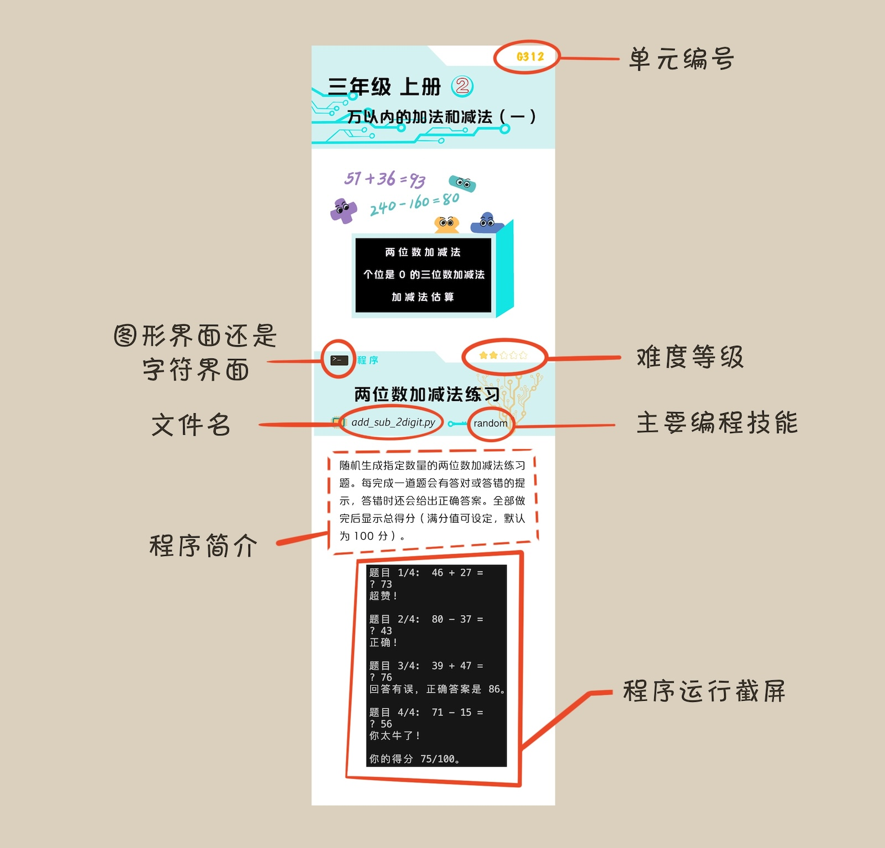</p>

* 所有程序中都有较为详细的文档说明 (Docstring) 和程序注释 (Comment)。Docstring 是在程序开头部分以及类和函数的开头部分以三引号包裹的字符串。

    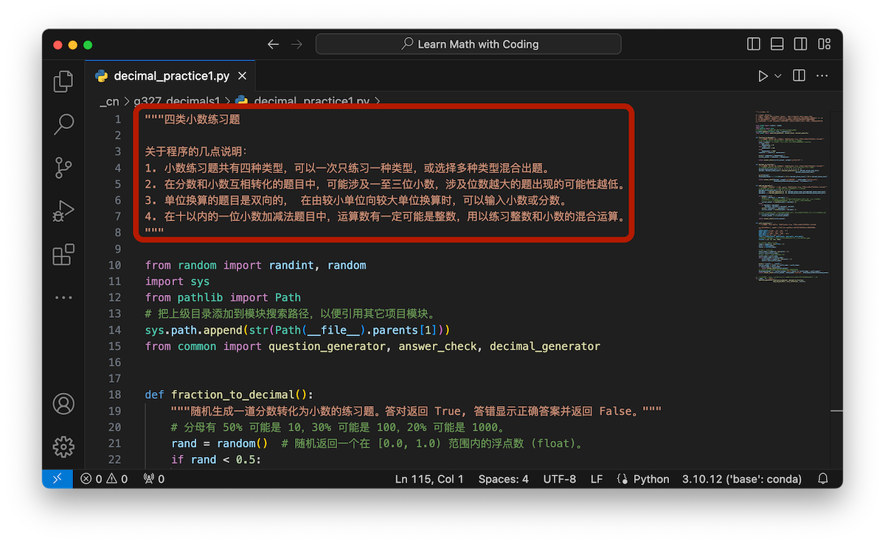

* 学习手册和所有程序都有英文和中文两个独立版本。`_en` 目录是英文版；`_cn` 目录是与 `_en` 目录结构完全一样的中文版。
* 代码库中有些文件之间存在相互引用关系，所以建议下载整个代码库使用。
* 关于程序中数学内容的几点说明：
    * 所有数学单位都采用国际单位制 SI (International System)。
    * 程序中所有竖式的显示与中国教材中的竖式形式相同。

        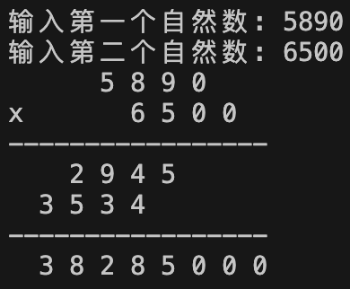

## 数学单元程序列表

| 编号 | 单元（对应人教版数学教材） | 程序 |
| --- | --- | --- |
| G311 | 时、分、秒 | 1. 表盘时钟<br>2. 数字时钟计数器 |
| G312 | 万以内的加法和减法（一） | 两位数加减法练习 |
| G313 | 测量 | 单位换算练习 |
| G314 | 万以内的加法和减法（二） | 1. 加法竖式<br>2. 加法竖式 |
| G315 | 倍的认识 | 与“倍”有关的文字题 |
| G316 | 多位数乘一位数 | 多位数乘一位数乘法竖式 |
| G317 | 长方形和正方形 | 创建长方形类 |
| G318 | 分数的初步认识 | 分数比大小练习 |
| G319 | 数学广角——集合 | 集合运算 |
| G321 | 位置与方向（一） | 辨认方向练习 |
| G322 | 除数是一位数的除法 | 除数是一位数的除法竖式 |
| G323 | 复式统计表 | 创建表格类及在字符界面显示表格 |
| G324 | 两位数乘两位数 | 多位数乘法竖式 |
| G325 | 面积 | 完善长方形类——求面积和画长方形 |
| G326 | 年、月、日 | 显示某年某月的日历 |
| G327 | 小数的初步认识 | 1. 四类小数练习题<br>2. 小数的形象化表示 |
| G328 | 数学广角——搭配（二） | 三类常见计数问题 |
| G411 | 大数的认识 | 读出任意自然数 |
| G412 | 公顷和平方千米 | 面积单位换算练习 |
| G413 | 角的度量 | 画表盘 |
| G414 | 三位数乘两位数 | 通用乘法竖式 |
| G415 | 平行四边形和梯形 | 数梯形 |
| G416 | 除数是两位数的除法 | 通用除法竖式 |
| G417 | 条形统计图 | 1. 应用 Matplotlib 绘制条形统计图<br>2. 创建带有绘图功能的表格类的子类 |
| G418 | 数学广角——优化 | 报数游戏 |
| G421 | 四则运算 | 有括号的四则混合运算 |
| G422 | 观察物体（二） | 几何体三视图 |
| G423 | 运算定律 | 解 24 点 |
| G424 | 小数的意义和性质 | 三类小数练习题 |
| G425 | 三角形 | 1. 画等腰三角形<br>2. 画正多边形 |
| G426 | 小数的加法和减法 | 小数加减法竖式 |
| G427 | 图形的运动（二） | 随机生成轴对称图形 |
| G428 | 平均数与条形统计图 | 复式条形统计图和平均数 |
| G429 | 数学广角——鸡兔同笼 | 鸡兔同笼 |
| G511 | 小数乘法 | 小数乘法竖式 |
| G512 | 位置 | 1. 坐标游戏——根据位置输入坐标<br>2. 坐标游戏——根据坐标点击位置 |
| G513 | 小数除法 | 1. 小数除法竖式<br>2. 常见分数转化为小数练习 |
| G514 | 可能性 | 1. 随机选择可能性不同的选项<br>2. 两个骰子的点数和 |
| G515 | 简易方程 | 列方程求解鸡兔同笼问题 |
| G516 | 多边形的面积 | 多边形类的面积属性 |
| G517 | 数学广角——植树问题 | 植树问题 |
| G521 | 观察物体（三） | 几何体三视图 v2 |
| G522 | 因数与倍数 | 1. 获取 n 以内的所有质数<br>2. 哥德巴赫猜想 |
| G523 | 长方体和正方体 | 1. 带有单位属性的长方体类<br>2. 体积单位换算 |
| G524 | 分数的意义和性质 | 1. 最大公因数和最小公倍数<br>2. 小数转化为最简分数 |
| G525 | 图形的运动（三） | 图形绕一点旋转 |
| G526 | 分数的加法和减法 | 分数加减法 |
| G527 | 折线统计图 | 复式折线统计图 |
| G528 | 数学广角——找次品 | 找次品 |

## 编程问题设计原则

1. 编程问题贴近本单元数学内容，既能帮助学数学，又能把所学的数学知识学以致用，一举两得。
2. 数学教材在编排上循序渐进，前后的数学内容很多是有联系的，所以编程问题也尽量联系起来，这主要体现在以下几方面：
    * 前后呈递进关系的数学单元，也对应着呈递进关系的程序系列；
    * 编程讲求 DRY 原则 (Don’t Repeat Yourself)，后面的程序可以复用 (Reuse) 前面的程序；
    * 后面的程序可以经常重复前面程序中用到的编程知识和技巧。
3. 编程问题中逐渐涉及更多的编程知识和技巧。程序中涉及的主要编程知识包括：
    * 基本数据类型 (int, float, string)、变量、函数、条件、循环
    * 包含多个数据的数据类型 (容器 Container)：列表 (list)、元组 (tuple)、字典 (dict)、集合 (set)
    * 类和对象 (OOP)
    * 常用模块 (Modules)、包 (Package)、库 (Library)
        * 随机 random
        * 图形界面编程 turtle, tkinter
        * 搭配排列组合 itertools
        * 数据统计绘图 matplotlib
    * 线程 (Thread)
    * 异常处理 (Raise/Handle Exception)

## 程序设计理念

本项目中的程序设计理念是：用尽可能清晰、明确的方式，把人解决问题的方法和步骤翻译成机器的语言（即 Python 程序）。这主要出于以下考虑：

1. 对于编程的初学者而言，首要目标是所编写的程序能够得到预期结果，这是一个熟悉编程语言和建立编程信心的过程，所以程序算法一定要简单直观、易于理解。
2. 编程逐渐成为一项必备技能，但毕竟只有少部分人会从事计算机和软件开发工作，而大部分人的工作并不需要了解算法和数据结构，他们会应用编程技能在各自行业和领域中指挥机器做一些繁杂重复且绝对精确的自动化工作，涉及的数据规模相对不大，所需的就是能够把工作步骤翻译成机器语言。

所以我们选用了“结果优先”、而非“效率优先”的程序设计理念。但当遇到运行时间受输入数据影响较大的编程问题时，也会引导学习者去体会采用不同方法的程序，虽然都能得出一样的结果，但程序运行时间可能存在巨大差异。

## 运行环境搭建

### 安装 Python，以下三种方式任选一种即可。

1. [Python 官网下载安装包](https://www.python.org/downloads/)（适合各种操作系统）。Windows 用户在安装时注意勾选 “Add python.exe to PATH”。

    <p align="center">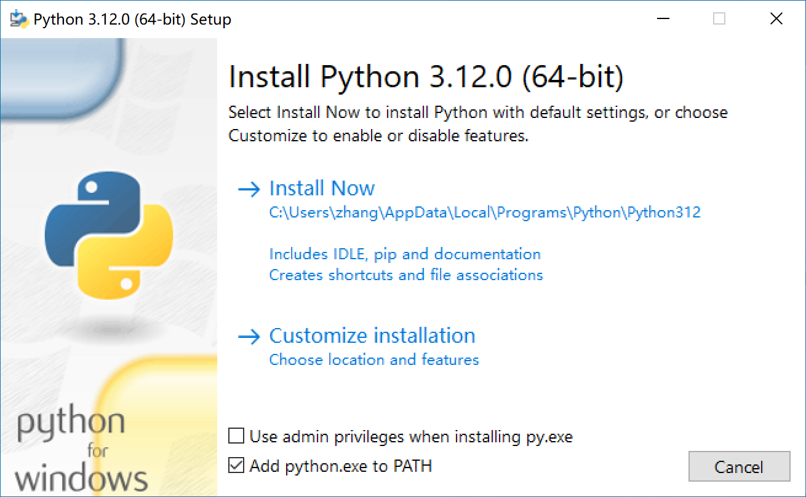</p>

2. [安装 Anaconda 或 Miniconda](https://docs.conda.io/projects/conda/en/stable/user-guide/install/download.html)（适合各种操作系统）。Conda 是一个开源的软件包管理系统和环境管理系统。安装了Conda 也就同时安装了 Python 和一些常用的 Module。
3. 使用 [Homebrew](https://brew.sh/) 安装 Python（适合 macOS 和 Linux 操作系统）。Homebrew 是一个开源的软件包管理系统。如果系统中已经安装了 Homebrew，可以使用以下命令安装 Python：
    
    ```bash
    brew install python-tk
    ```

### 代码编辑器 (Code Editor)

1. IDLE (Integrated Development and Learning Environment) 是 Python 自带的编程工具，包含交互式解释器和代码编辑器。IDLE 作为代码编辑器仅满足基本功能，推荐使用功能更强大的代码编辑器，例如 VS Code。
    
    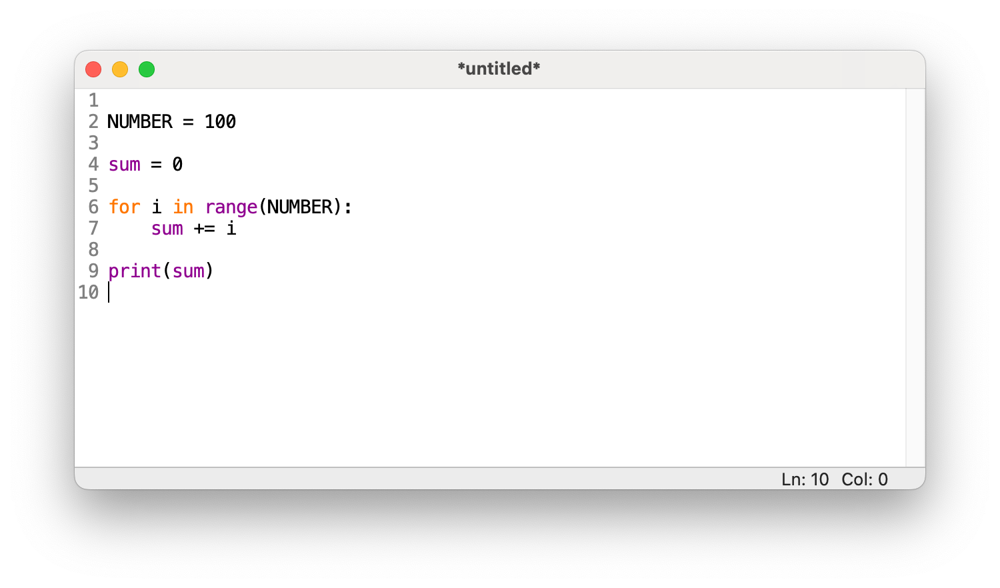
    
2. VS Code (Visual Studio Code)
    * [先下载安装 VS Code](https://code.visualstudio.com/download)；
    * 启动 VS Code 后，在插件栏 (Extensions) 中搜索并安装 Python 插件。

    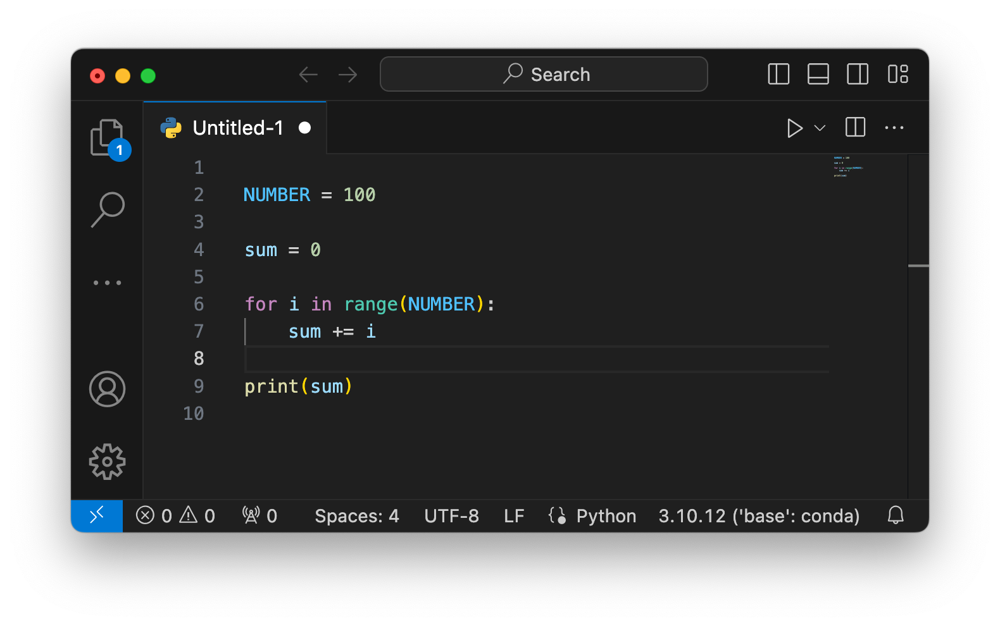

### 交互式解释器 (Interactive Interpreter)

交互式解释器是一个非常有用的 Python 命令行界面，在这个界面中输入任何 Python 表达式，结果会即时显示在屏幕上。因此非常适合进行小代码片段的实验，例如试一下内置数据类型或函数的用法。建议编程时除了在代码编辑器中输入代码外，也同时打开一个交互式解释器，以便在对一个表达式的结果不确定时，可以立即在交互式解释器中进行实验验证。

可以通过以下方式进入交互式解释器：

1. 对于 macOS 或 LInux 用户，可以在 Terminal 中输入 `python` 进入交互式解释器。如果系统找不到 `python`，可以尝试输入 `python3`。
    
    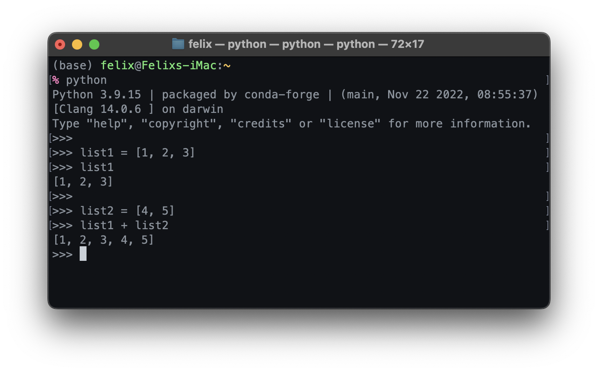
    
2. Windows 用户可以通过在菜单中点击 Python，或在命令提示符 (Command Prompt) 窗口中 (cmd.exe) 输入 `python` 进入交互式解释器。如果系统找不到 `python`，可以尝试输入 `python3` 或 `py`。
3. Python 自带的编程工具 IDLE 启动后即进入交互式解释器。
    
    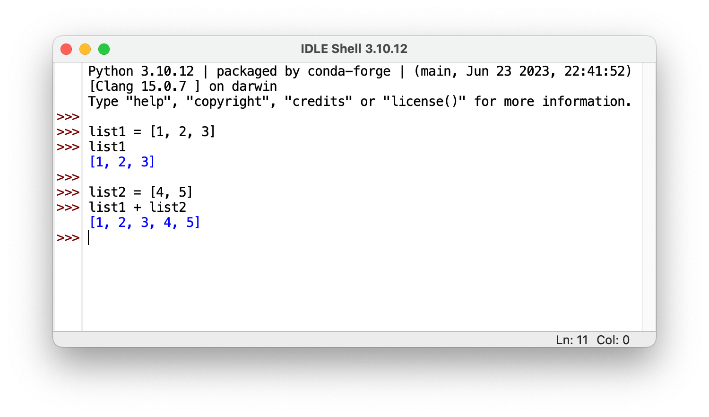
    
4. 通过 VS Code 内置的 Terminal 或交互式窗口也可以进入交互式解释器。

### 安装外部库 (Library)

1. 像 turtle, tkinter 等模块或包属于 Python 标准库 (The Python Standard Library)，会随 Python 一同安装，不需要额外安装。
2. [Matplotlib](https://matplotlib.org/stable/users/installing/index.html) 是流行的 Python 可视化绘图库，可用如下方法安装：
    * 用 Python 的 `pip` 模块安装。如果系统找不到 `python`，可以尝试把下面命令中的 `python` 替换为 `python3` 或 `py` (Windows 用户)

        ```bash
        python -m pip install -U matplotlib
        ```

    * 如果安装了 Conda，可以用 `conda` 命令安装。

        ```bash
        conda install matplotlib
        ```

3. [Pygame](https://www.pygame.org/news) 是流行的 Python 游戏开发库，代码库中的 G512 单元《坐标游戏》用到了 Pygame 中的声音模块。安装方法同 Matplotlib。
    * 用 Python 的 `pip` 模块安装。

        ```bash
        python -m pip install -U pygame
        ```

    * 如果安装了 Conda，可以用 conda 命令安装。

        ```bash
        conda install pygame
        ```

## 常用参考资料

* [W3Schools](https://www.w3schools.com/python/default.asp)
    * [Built-in Functions](https://www.w3schools.com/python/python_ref_functions.asp)
    * [String Methods](https://www.w3schools.com/python/python_ref_string.asp)
    * [List Methods](https://www.w3schools.com/python/python_ref_list.asp)
    * [Random Module](https://www.w3schools.com/python/module_random.asp)
* [Turtle](https://docs.python.org/3/library/turtle.html)
* Tkinter
    * [TkDocs](https://tkdocs.com/tutorial/index.html)
    * [Tkinter Reference](https://anzeljg.github.io/rin2/book2/2405/docs/tkinter/index.html)
* [Matplotlib](https://matplotlib.org/stable/users/explain/quick_start.html)
* [Color Names](https://www.w3schools.com/colors/colors_groups.asp)
* [PEP8](https://peps.python.org/pep-0008/) - 建议的 Python 代码规范

</br>

[⏫ 返回顶部](#top)
