<div id="top"></div>

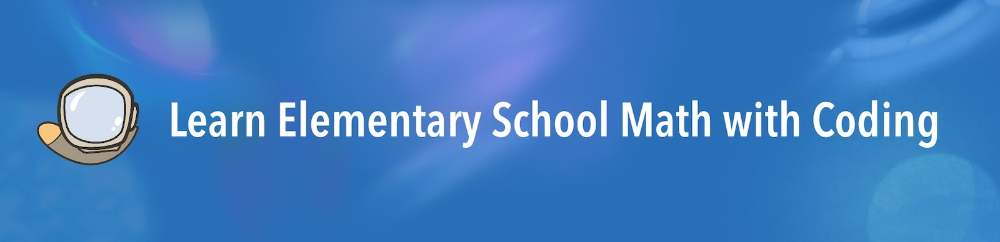

[](../LICENSE)
[](https://www.python.org/)

<h4 align="center">English | <a href="../_cn/README.md">中文</a></h4>

## Table of Contents
* [What is this?](#what-is-this)
* [Who is this for?](#who-is-this-for)
* [Project Origins](#project-origins)
* [Project Goals](#project-goals)
* [Usage Information](#usage-information)
* [数学单元程序列表](#数学单元程序列表)
* [Design Principles of Coding Exercises](#design-principles-of-coding-exercises)
* [Programming Style](#programming-style)
* [Setting Up the Development Environment](#setting-up-the-development-environment)
    * [Installing Python](#installing-python---choose-one-of-the-following-three-methods)
    * [Code Editor](#code-editor)
    * [Interactive Interpreter (Python shell)](#interactive-interpreter-python-shell)
    * [Installing External Libraries](#installing-external-libraries)
* [Useful Resources for Referencing](#useful-resources-for-referencing)

## What is this?

In 2022, my parents entrusted me to help my younger brother learn elementary school mathematics. At the time, he was six years old, and I was a freshman in high school. To tackle this project, I formulated a plan - after he completed each unit in his math textbook, I would design and assign him 1-2 coding exercises, written in Python, that closely relate to the unit's content. Using this approach combining mathematics and programming, we managed to complete an average of one semester's worth of coursework every two months. In about a year, we had finished the Chinese elementary mathematics curriculum from grades three to five.

The project library contains 60 Python programs that we wrote during the year, including 22 with graphical user interfaces and 38 with command line interfaces. These programs cover all 49 units from the third- to fifth-grade Chinese mathematics textbooks of the People's Education Press. The `math_coding_handbook.pdf` file contains the main mathematical topics for each unit and descriptions of the corresponding programs(s). We have also included detailed documentation and comments within all programs.

| `Graphical User Interface` | `Command Line Interface` |
| --- | --- |
| 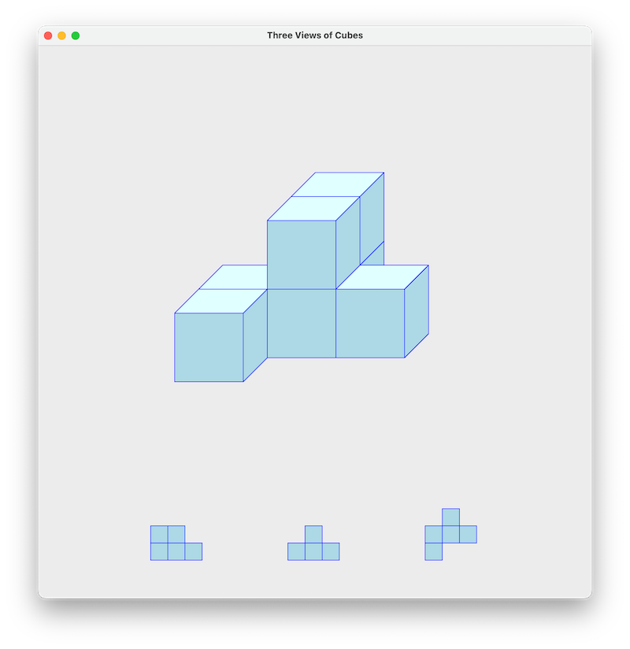 | 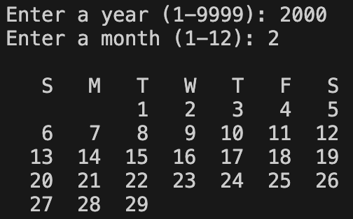 |

All programs and the companion handbook have separate versions in English and Chinese. The `_en` directory contains the English version, with all graphical displays and program comments in English. The `_cn` directory contains the Chinese version, with all graphical displays and program comments in Chinese.

<p align="center">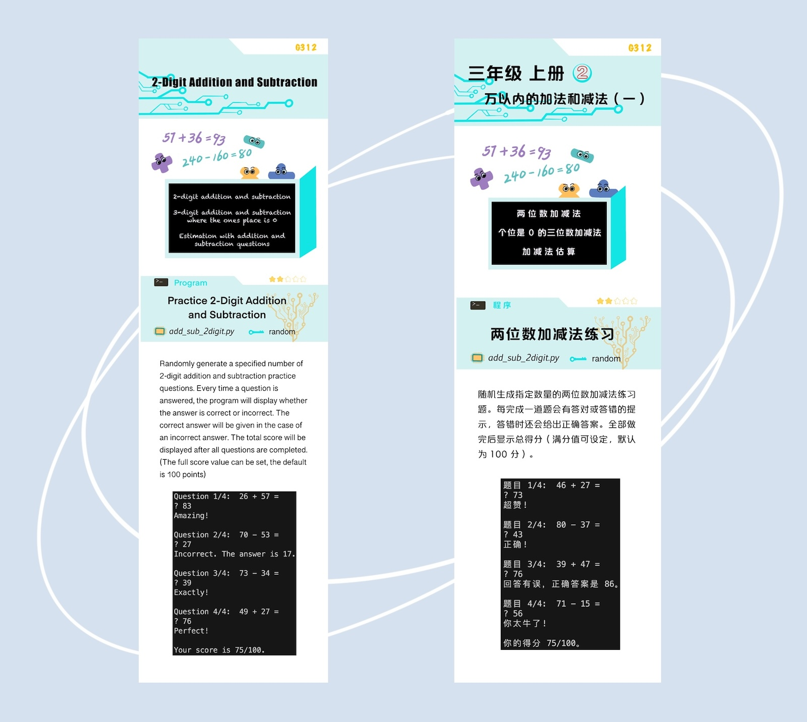</p>

[Download math_coding_handbook.pdf (English version)](math_coding_handbook.pdf)

[Download math_coding_handbook.pdf (Chinese version)](../_cn/小学数学编程学习手册.pdf)

Through this project, my brother and I have proven in practice that learning elementary math with coding allows learners to efficiently and effectively study mathematics while simultaneously becoming proficient in a programming language.

## Who is this for?

To effectively learn elementary school math with coding through this project requires the following:

1. Elementary school students interested in mathematics and programming.
2. People willing to invest time and effort in guiding children through the coding exercises, including but not limited to parents, older siblings, teachers, or community volunteers.

There are two ways to use this project:

1. Following the school curriculum: This project can serve as a supplementary learning resource for school mathematics curriculums, suitable for learners who want to learn math and coding simultaneously.
2. According to personal progress: You can follow the coding exercises in this project to accelerate the completion of elementary school mathematics. For details, please refer to [our website](https://feli10.github.io/math-coding/project.html).

## Project Origins

In 2022, when my younger brother Henry was six years old, my parents asked me to take charge of his mathematics and English education temporarily. At the time, I was ten years older than him and in my first year of high school. The initial goal we agreed upon was that, before I went to college, I would help him complete elementary school math and reach a level of English proficiency where he could continue to improve independently. Since I was the best in the family at English, there weren't many uncertainties about that, but how would I go about teaching him math?

I completed elementary school mathematics when I was nine years old. Looking back, I remember reading many textbooks, doing lots of practice problems, and taking quite a few mock tests. After some consideration, I realized Henry, who was only six, needed a different approach. Based on my learning experience, when someone constantly struggles with a particular type of math problem, it's usually because they lack a deep understanding of the underlying concepts. The purpose of doing practice problems should be to identify and address these weaknesses. However, If one does practice problems mindlessly, the same mistakes will appear again and again. This is why doing a sea of practice problems is often not an efficient way to learn new math topics. Therefore, I aimed to find an approach that would allow Henry to thoroughly understand any math concepts and skills he needs to learn before diving into extensive problem-solving.

The primary inspiration for combining math and coding came from taking high-level math courses as part of a machine learning research project. While taking the courses, I found that using programming tools to assist in learning mathematics at the university level was quite common and highly effective. When learning calculus, linear algebra, and statistics, programming was used to conduct mathematical experiments and solve practical problems. Coupled with the visualization of results, this greatly aided my understanding of abstract mathematical concepts and theorems. Later, I also found a few resources for learning middle school mathematics with the help of programming. However, I never found anything that combined elementary school mathematics with programming.

So, after discussing my idea with Henry, the "Learn Elementary School Math with Coding" project was born.

## Project Goals

In addition to the year-long math coding project with Henry, we organized several programming weekend events, in which I led 5-10 children to learn mathematics with programming. Because these events were quite successful, I believe this project can benefit more children - allowing them to learn math efficiently with improved learning outcomes while equipping them with programming skills.

For children following the school curriculum, we hope this project can help them enhance their math and programming abilities. We also hope this project allows those who wish to accelerate their math learning, like Henry, to do so. One benefit of accelerated learning is that knowledge of fundamental mathematics can facilitate early interest development. For example, Henry's mathematic abilities greatly aided his music learning, allowing his musical interest and talent to develop early.

I hope this project can provide people with a new approach to learning mathematics and bring more opportunities to those who choose to use it. If you have any questions or suggestions about the project, feel free to contact me by this email: math-coding@hotmail.com.

## Usage Information

* The organization of the directories is identical to the elementary school mathematics textbook of the Chinese People's Education Press. For example, for the directory name `g311_time`, the "g311" at the beginning identifies that the directory corresponds to unit 1 of semester 1 of the grade 3 textbook.
    * The "g" and the digit following it represent the grade.
    * The second digit may be either 1 or 2. 1 represents the first semester, and 2 represents the second semester.
    * The third digit represents the specific unit within the textbook.
* The text after the identifier indicates the main learning content of the unit. The G311 unit is mainly about telling time, so the directory name of this unit is `g311_time`.
* Each directory contains 1-2 个 Python program files. The names of the programs are indicative of their contents. For example, `g311_time` contains two programs: `clock.py`, which displays a functioning analog clock, and `digital_clock.py`, which displays a functioning digital clock.
* the `math_coding_handbook.pdf` file in the `_en` directory contains description pages for all 60 programs across 49 units from grades 3 to 5. Each program description page contains the following:
    * File name.
    * Graphical display or command line display.
    * Difficulty rating (1 to 5 stars).
    * Programming skills used.
    * Program description.
    * Screenshots of program output.

    <p align="center">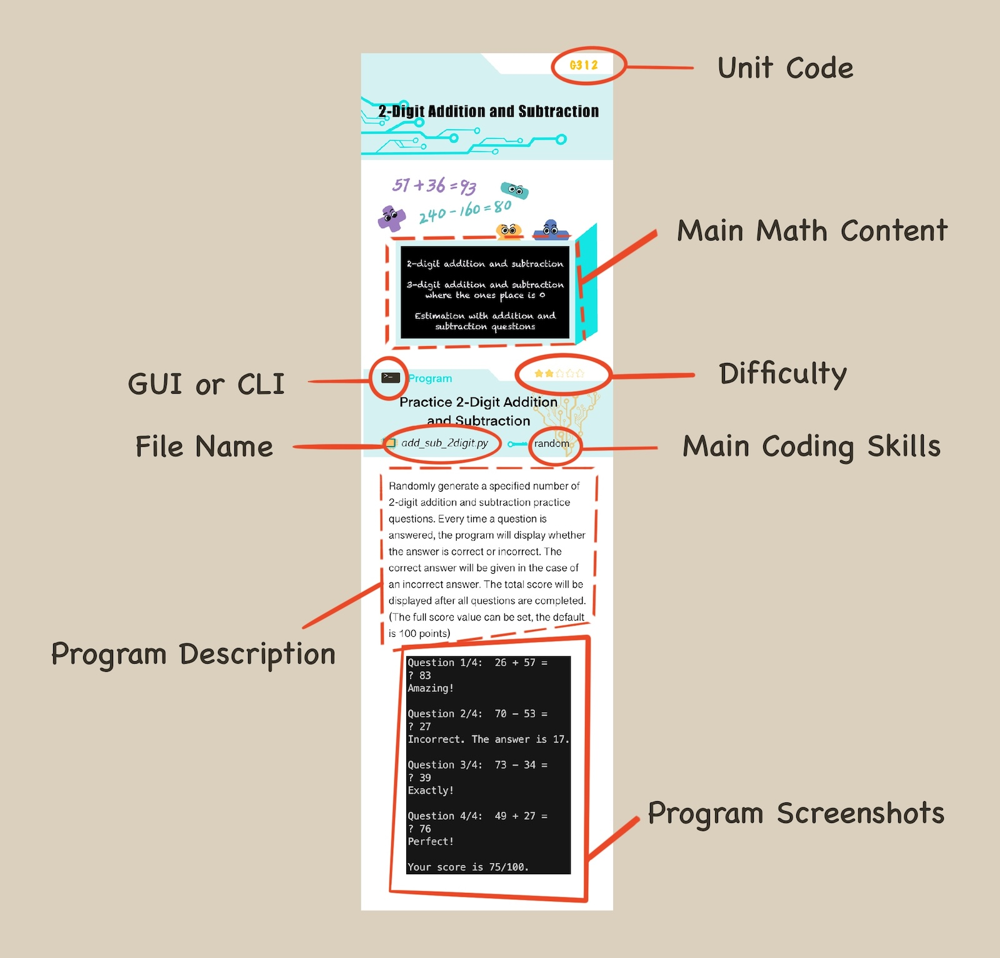</p>

* All programs contain a detailed docstring at the beginning and useful comments throughout.

    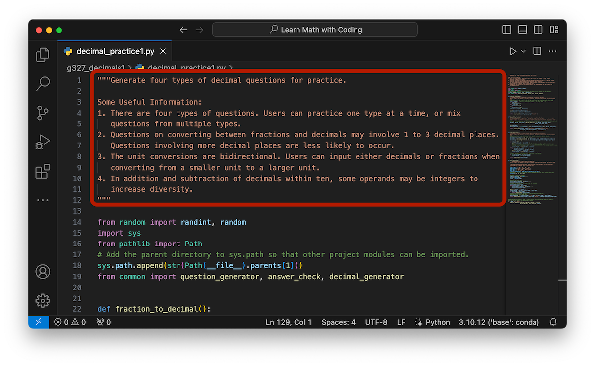

* The companion handbook and all programs have separate English and Chinese versions. The `_en` and `_cn` directories are organized in the same way but with content in English and Chinese, respectively.
* Some programs in the code library contain references to each other. Therefore, we recommend downloading the entire code library before use.
* A few notes on the mathematical content of the program:
    * All mathematical units are in SI (International System).
    * The display of vertical form arithmetics in certain programs is based on the vertical forms shown in Chinese textbooks.

        

## 数学单元程序列表

| 编号 | 课程（对应人教版数学教材） | 程序 |
| --- | --- | --- |
| G311 | 时、分、秒 | 1. 表盘时钟<br>2. 数字时钟计数器 |
| G312 | 万以内的加法和减法（一） | 两位数加减法练习 |
| G313 | 测量 | 单位换算练习 |
| G314 | 万以内的加法和减法（二） | 1. 加法竖式<br>2. 加法竖式 |
| G315 | 倍的认识 | 与“倍”有关的文字题 |
| G316 | 多位数乘一位数 | 多位数乘一位数乘法竖式 |
| G317 | 长方形和正方形 | 创建长方形类 |
| G318 | 分数的初步认识 | 分数比大小练习 |
| G319 | 数学广角——集合 | 集合运算 |
| G321 | 位置与方向（一） | 辨认方向练习 |
| G322 | 除数是一位数的除法 | 除数是一位数的除法竖式 |
| G323 | 复式统计表 | 创建表格类及在字符界面显示表格 |
| G324 | 两位数乘两位数 | 多位数乘法竖式 |
| G325 | 面积 | 完善长方形类——求面积和画长方形 |
| G326 | 年、月、日 | 显示某年某月的日历 |
| G327 | 小数的初步认识 | 1. 四类小数练习题<br>2. 小数的形象化表示 |
| G328 | 数学广角——搭配（二） | 三类常见计数问题 |
| G411 | 大数的认识 | 读出任意自然数 |
| G412 | 公顷和平方千米 | 面积单位换算练习 |
| G413 | 角的度量 | 画表盘 |
| G414 | 三位数乘两位数 | 通用乘法竖式 |
| G415 | 平行四边形和梯形 | 数梯形 |
| G416 | 除数是两位数的除法 | 通用除法竖式 |
| G417 | 条形统计图 | 1. 应用 Matplotlib 绘制条形统计图<br>2. 创建带有绘图功能的表格类的子类 |
| G418 | 数学广角——优化 | 报数游戏 |
| G421 | 四则运算 | 有括号的四则混合运算 |
| G422 | 观察物体（二） | 几何体三视图 |
| G423 | 运算定律 | 解 24 点 |
| G424 | 小数的意义和性质 | 三类小数练习题 |
| G425 | 三角形 | 1. 画等腰三角形<br>2. 画正多边形 |
| G426 | 小数的加法和减法 | 小数加减法竖式 |
| G427 | 图形的运动（二） | 随机生成轴对称图形 |
| G428 | 平均数与条形统计图 | 复式条形统计图和平均数 |
| G429 | 数学广角——鸡兔同笼 | 鸡兔同笼 |
| G511 | 小数乘法 | 小数乘法竖式 |
| G512 | 位置 | 1. 坐标游戏——根据位置输入坐标<br>2. 坐标游戏——根据坐标点击位置 |
| G513 | 小数除法 | 1. 小数除法竖式<br>2. 常见分数转化为小数练习 |
| G514 | 可能性 | 1. 随机选择可能性不同的选项<br>2. 两个骰子的点数和 |
| G515 | 简易方程 | 列方程求解鸡兔同笼问题 |
| G516 | 多边形的面积 | 多边形类的面积属性 |
| G517 | 数学广角——植树问题 | 植树问题 |
| G521 | 观察物体（三） | 几何体三视图 v2 |
| G522 | 因数与倍数 | 1. 获取 n 以内的所有质数<br>2. 哥德巴赫猜想 |
| G523 | 长方体和正方体 | 1. 带有单位属性的长方体类<br>2. 体积单位换算 |
| G524 | 分数的意义和性质 | 1. 最大公因数和最小公倍数<br>2. 小数转化为最简分数 |
| G525 | 图形的运动（三） | 图形绕一点旋转 |
| G526 | 分数的加法和减法 | 分数加减法 |
| G527 | 折线统计图 | 复式折线统计图 |
| G528 | 数学广角——找次品 | 找次品 |

## Design Principles of Coding Exercises

1. The exercises are closely related to the math content introduced in their corresponding units.
2. Math curriculums are usually organized in a progressive manner, with content in later units connected with earlier ones. Therefore, we also strive to establish connections in programming, which is primarily reflected in the following aspects:
    * Math units that progress sequentially correspond to programs that also progress sequentially.
    * Coding exercises adhere to the DRY principle (Don't Repeat Yourself), allowing later programs to reuse earlier ones.
    * Later programs often revisit programming knowledge and techniques established in earlier programs.
3. Coding exercises gradually involve more programming knowledge and skills. Programming knowledge covered includes:
    * Basic data types (int, float, string), variables, functions, conditionals, loops.
    * Data types containing multiple elements (Containers): lists, tuples, dictionaries, sets.
    * Classes and objects (OOP).
    * Common modules, packages, and libraries:
        * Random: random
        * Graphical interface programming: turtle, tkinter.
        * Combinatorics: itertools.
        * Data visualization: matplotlib.
    * Threads.
    * Exception handling (Raise/Handle Exception).

## Programming Style

The goal of programs in this project is to translate human problem-solving methods into machine language (i.e., Python programs) as clearly and explicitly as possible. This is mainly due to the following considerations:

1. For beginner programmers, the primary goal is to write a program that can achieve the expected results. This is a process of becoming familiar with the programming language and building confidence. So, the programs must be simple, intuitive, and easy to understand.
2. Programming is gradually becoming an essential skill, but only a small percentage of individuals will pursue careers in computer and software development. Most people don’t need to know how to create the most optimal algorithms or data structures. All they need is the ability to translate work processes into machine language, which will allow them to automate repetitive and precise tasks, mostly involving small amounts of data.

Therefore, we prioritized results above efficiency for most of our programs. However, when encountering programming problems where runtime is greatly affected by input data, learners will be guided to try different programming methods of varying efficiencies.

## Setting Up the Development Environment

### Installing Python - Choose one of the following three methods:

1. [Download the Python installer from Python's official website](https://www.python.org/downloads/) (suitable for various operating systems). For Windows users, make sure to check the "Add python.exe to PATH" option during installation.

    <p align="center">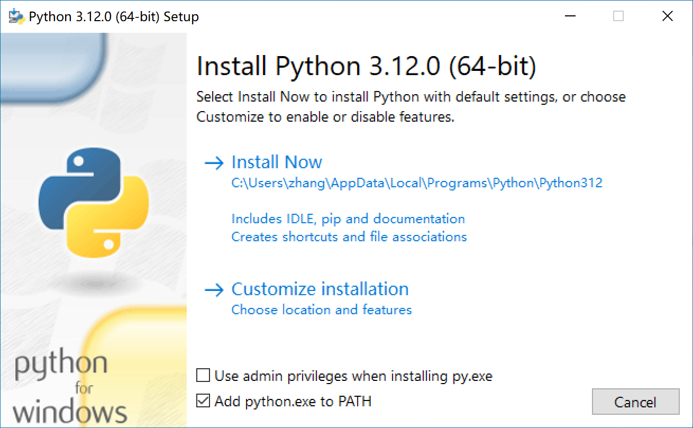</p>
   
3. [Install Anaconda or Miniconda](https://docs.conda.io/projects/conda/en/stable/user-guide/install/download.html) (suitable for various operating systems). Conda is an open-source package and environment management system. Installing Conda also installs Python and some commonly used modules.
4. Use [Homebrew](https://brew.sh/) to install Python (suitable for macOS and Linux operating systems). Homebrew is an open-source package management system. If Homebrew is already installed on your system, you can use the following command to install Python:
    
    ```bash
    brew install python-tk
    ```

### Code Editor

1. IDLE (Integrated Development and Learning Environment) is the built-in programming tool for Python. It includes an interactive interpreter and code editor. IDLE only has bare-bone functionalities, so it is recommended to use a more powerful code editor like VS Code.

    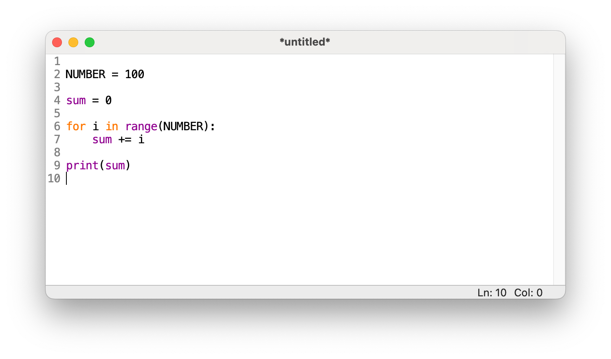

2. VS Code (Visual Studio Code)
    * [First, download and install VS Code](https://code.visualstudio.com/download).
    * After launching VS Code, search for and install the Python extension in the Extensions panel. 

    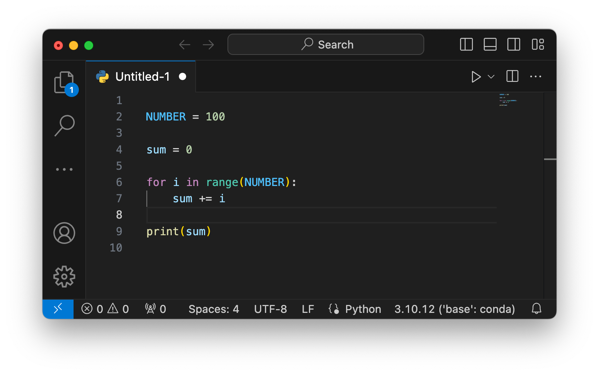

### Interactive Interpreter (Python shell)

A Python interactive interpreter, otherwise known as a shell, is a very useful command-line interface where you can enter any Python expression, and the results will be displayed on the screen instantly. The interpreter is ideal for experimenting with small code snippets, such as testing the usage of built-in data types or functions. It is recommended that when programming, you not only input code in the code editor but also have an interactive interpreter open at the same time. This allows you to experiment and verify the results immediately in the interpreter when the outcome of an expression is uncertain.

You can access the Python interactive interpreter in the following ways:

1. For macOS or Linux users, you can enter `python` in the terminal to access the interactive interpreter. If the system doesn't recognize `python`, you can try `python3`.

    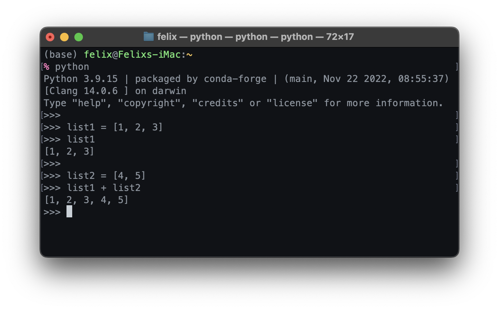

2. Windows users can access the interactive interpreter by clicking "Python" in the menu or entering `python` in the Command Prompt window (cmd.exe). If the system doesn't recognize `python`, you can try `python3` or `py`.
3. The built-in programming tool IDLE in Python directly opens the interactive interpreter when launched.

    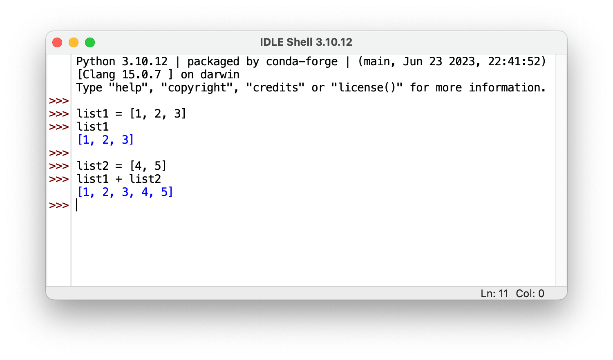

4. You can also access the interactive interpreter through VS Code's built-in terminal or interactive window.

### Installing External Libraries

1. Modules or packages like turtle and tkinter are part of the Python Standard Library and come pre-installed with Python, so no additional installation is required.
2. [Matplotlib](https://matplotlib.org/stable/users/installing/index.html) is a popular Python data visualization library and can be installed using the following methods:
    * Install using Python's `pip` module. If the system doesn't recognize `python`, you can replace `python` with `python3` or `py` (for Windows users) in the commands below:
        
        ```bash
        python -m pip install -U matplotlib
        ```
        
    * If Conda is installed, you can use the `conda` command for installation:
        
        ```bash
        conda install matplotlib
        ```
        
3. [Pygame](https://www.pygame.org/news) is a popular Python game development library. The G512 program "Coordinate Game" uses the sound module from Pygame. You can install it in a similar way to Matplotlib:
    * Install using Python's `pip` module:
        
        ```bash
        python -m pip install -U pygame
        ```
        
    * If Conda is installed, you can use the `conda` command for installation:
    
        ```bash
        conda install pygame
        ```

## Useful Resources for Referencing

* [W3Schools](https://www.w3schools.com/python/default.asp)
    * [Built-in Functions](https://www.w3schools.com/python/python_ref_functions.asp)
    * [String Methods](https://www.w3schools.com/python/python_ref_string.asp)
    * [List Methods](https://www.w3schools.com/python/python_ref_list.asp)
    * [Random Module](https://www.w3schools.com/python/module_random.asp)
* [Turtle](https://docs.python.org/3/library/turtle.html)
* Tkinter
    * [TkDocs](https://tkdocs.com/tutorial/index.html)
    * [Tkinter Reference](https://anzeljg.github.io/rin2/book2/2405/docs/tkinter/index.html)
* [Matplotlib](https://matplotlib.org/stable/users/explain/quick_start.html)
* [Color Names](https://www.w3schools.com/colors/colors_groups.asp)
* [PEP8](https://peps.python.org/pep-0008/) - Style Guide for Python Code

</br>

[⏫ Back to Top](#top)
